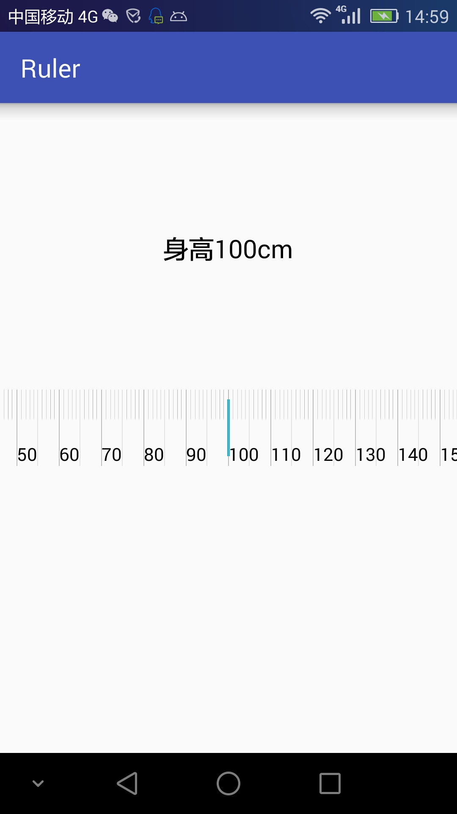

# Ruler
这是一个Android自定义控件------尺子
###开发工具
工具：Android Studio
### 使用方法
    <com.ggx.ruler_lib.RulerView
      android:id="@+id/rv"
      android:layout_width="match_parent"
      android:layout_height="80dp"
      app:defaultValue="60"
      app:direction="horizontal"
      app:endValue="100"
      />
该控件有3个属性：
* defaultValue表示默认尺子现在在多少刻度上；
* direction有两个值1.horizontal表示水平放置尺子，2.vertical表示垂直放置尺子；
* endValue 表示尺子的最大刻度到多少，其实刻度从0开始

***

该控件会返回滑动过后的数值我们只需要向下面这样做即可：

    RulerView rv= (RulerView) findViewById(R.id.rv);
    //rv.setCallback(this);
    rv.setCallback(new RulerView.RulerCallback() {
        @Override
        public void resultNum(int num) {
            tv.setText("身高"+num+"cm");
        }
    });

### 水平效果截图

**Desinger by:** *ggx* 
